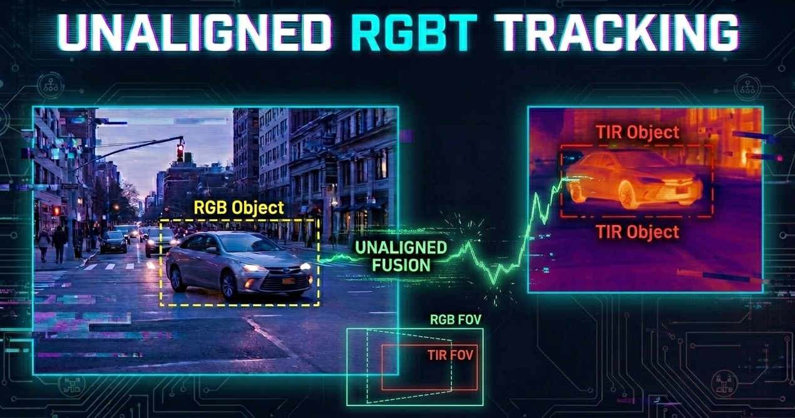

<h1 align="center">
<span>Unaligned RGBT Tracking Project
</span>
</h1>

<div align="center">
  
<p align="center">
  
</p>

</div>

<div align="center">

### 🔗 Quick Navigation

[](#-news)
[](#-public-release)
[](#-muart244-dataset)
[](#-luart-dataset)
[](#-lasher-unaligned)
[](#-evaluation-toolkit)
[](#-benchmark-results)
[](#-open-source-trackers)
[](#-citation)

</div>

---

This repository contains multiple research modules related to **multi-modal tracking**, **RGB–TIR fusion**, and **unaligned cross-modal UAV tracking**.  
Among them, our recent work:

> **“Progressive Multi-cue Alignment for Unaligned RGBT Tracking”**  
> has been **accepted by CVPR 2026** 🎉.
> 
> **“Unaligned UAV RGBT Tracking: A Largescale Benchmark and A Novel Approach”**  
> has been **accepted by AAAI 2026** 🎉.

This repository includes more than this single paper, but LUART and SFCATrack are important components released here.

---

## 🔔 News
- **2026.02** – Our **Progressive Multi-cue Alignment for Unaligned RGBT Tracking** is accepted by **CVPR 2026**.  
- **2025.11** – Our **Unaligned UAV RGBT Tracking: A Largescale Benchmark and A Novel Approach** is accepted by **AAAI 2026**.  
- **2025.11** – **LUART** (1.02M dual-modality frames) dataset is available for download.  
- Additional modules and trackers will be released soon.

---

## 📢 Public Release

We will progressively release the following resources to support reproducible research on unaligned RGBT tracking:

- **PMATrack code** for our CVPR 2026 paper  
  **Progressive Multi-cue Alignment for Unaligned RGBT Tracking**

- Existing released resources:
  - [**AAAI 2026 paper**](https://github.com/NOP1224/Unaligned_RGBT_Tracking/blob/main/Unaligned_UAV_RGBT_Tracking__A_Largescale_Benchmark_and_A_Novel_Approach_AAAI_CRC.pdf)
  - [**SFCATrack**](https://github.com/NOP1224/Unaligned_RGBT_Tracking/tree/main/SFCATrack)
  - [**LUART dataset**](https://github.com/NOP1224/Unaligned_RGBT_Tracking/blob/main/README.md#-download-links)
  - [**LUART evaluation toolkit**](https://github.com/NOP1224/Unaligned_RGBT_Tracking/blob/main/README.md#-download-links)
  - [**Unified evaluation toolkit**](https://github.com/NOP1224/Unaligned_RGBT_Tracking/tree/main/eval_tracker-ua) for unaligned RGBT tracking, built upon the standard RGBT evaluation protocol
  - **LasHeR-Unaligned result files**
  - **MUART244 dataset** and corresponding tracking result files

---

## 📦 MUART244 Dataset  
### Multi-platform Unaligned RGBT Tracking Dataset

**MUART244** is a high-quality multi-platform benchmark for unaligned RGBT tracking.  
Different from existing aligned RGBT datasets, MUART244 preserves the original spatial misalignment between RGB and TIR modalities without manual pre-alignment, cropping, or rescaling.

It includes:

- **244** RGBT video pairs
  - **143** ground-view sequences
  - **101** aerial-view sequences
- **205K** RGBT image pairs
- Average **844** frames per video
- **26** object categories
- **22** challenge attributes
- Precise dual-modal bounding-box annotations
- Original heterogeneous resolutions:
  - RGB: from **1600×1200** to **3840×2160**
  - TIR: from **640×512** to **1280×1024**

MUART244 provides a realistic benchmark for evaluating unaligned RGBT tracking under large spatial offsets, scale variations, multi-platform viewpoints, and modality-specific challenges.

### 📥 Download Links

**MUART244 Dataset**  
- Baidu Cloud: `https://pan.baidu.com/s/14D22dNDu6pNSKrO-6keNCw?pwd=am6y `
- Access Code: `am6y`

**MUART244 Tracking Results**  
- Baidu Cloud: ` https://pan.baidu.com/s/1qdqPz0RKIsW3v_FJafACUw?pwd=4prb`
- Access Code: `4prb`

---

## 📦 LUART Dataset  
### Unaligned UAV RGBT Tracking Dataset

**LUART** is the first large-scale benchmark focusing on *unaligned* UAV visible–thermal tracking.  
It includes:

- **1,453** RGB–TIR sequence pairs
- **1.02M** dual-modality frames
- **42** object categories
- **22** challenge attributes
- Original UAV resolutions:
  - RGB: **1920×1080**
  - TIR: **640×512**

### 📥 Download Links

**LUART Dataset**  
- Baidu Cloud:  `https://pan.baidu.com/s/168vWYtxPqoagds8WcPuJUA` 
- Access Code: `er4r`

**LUART Tracking Results**  
- Baidu Cloud: `https://pan.baidu.com/s/1AhY2rOL8PdPXL0MrEaR1Rw?pwd=pi2i`
- Access Code: `pi2i`
---

## 📦 LasHeR-Unaligned

We also provide **LasHeR-Unaligned**, a derived benchmark based on  
[LasHeR](https://github.com/BUGPLEASEOUT/LasHeR), where spatial alignment assumptions are explicitly removed to support fair evaluation of unaligned RGBT trackers.

### 📥 Download Links
**LasHeR-Unaligned Dataset**  
- Baidu Cloud: `https://pan.baidu.com/s/1OB9BbPQt16CAXwLqfc8hEA`
- Access Code: `mmic`

**LasHeR-Unaligned Tracking Results**  
- Baidu Cloud: `https://pan.baidu.com/s/1kFmqX65f82d8ijtj8hV_lQ?pwd=dhjx`
- Access Code: `dhjx`
---

## 🧪 [Evaluation Toolkit](https://github.com/NOP1224/Unaligned_RGBT_Tracking/tree/main/eval_tracker-ua)

We will release a unified evaluation toolkit for unaligned RGBT tracking based on the standard RGBT evaluation library.

The toolkit supports:

- **MUART244**
- **LasHeR-Unaligned**
- **LUART**
- One Pass Evaluation protocol
- Precision Rate (**PR**)
- Normalized Precision Rate (**NPR**)
- Success Rate (**SR**)
- Unified result format for fair comparison across different unaligned RGBT datasets

**Evaluation Toolkit**  
- Baidu Cloud: `https://pan.baidu.com/s/1gtoEsZPTCz_CDPhuc518jg?pwd=k2hp`
- Access Code: `k2hp`

---

## 📊 Benchmark Results

### ⭐ Overall Comparison on MUART244 / LasHeR-Unaligned / LUART

| Tracker | Publication | MUART244 PR ↑ | MUART244 NPR ↑ | MUART244 SR ↑ | LasHeR-UA PR ↑ | LasHeR-UA NPR ↑ | LasHeR-UA SR ↑ | LUART PR ↑ | LUART NPR ↑ | LUART SR ↑ |
|--------|-------------|---------------|----------------|---------------|----------------|-----------------|---------------|------------|-------------|------------|
| mfDiMP | ICCVW 2019 | - | - | - | - | - | - | 41.6 | 40.1 | 33.5 |
| MANet | ICCVW 2019 | - | - | - | 32.9 | 26.6 | 24.1 | - | - | - |
| MaCNet | Sensors 2020 | - | - | - | 38.4 | 30.7 | 27.0 | - | - | - |
| CAT | ECCV 2020 | - | - | - | 36.3 | 29.9 | 25.3 | 42.8 | 39.8 | 34.4 |
| FANet | TIV 2021 | - | - | - | 32.8 | 26.6 | 22.7 | - | - | - |
| ADRNet | IJCV 2021 | - | - | - | 34.5 | 29.2 | 23.8 | 44.6 | 43.1 | 33.0 |
| MANet++ | TIP 2021 | - | - | - | 30.1 | 23.9 | 20.3 | - | - | - |
| APFNet | AAAI 2022 | - | - | - | 40.3 | 32.4 | 29.1 | - | - | - |
| DMCNet | TNNLS 2022 | - | - | - | 35.1 | 27.7 | 25.7 | - | - | - |
| HMFT | CVPR 2022 | - | - | - | - | - | - | 44.5 | 41.5 | 35.7 |
| ToMP | CVPR 2022 | - | - | - | 46.3 | 41.4 | 36.0 | - | - | - |
| OSTrack | ECCV 2022 | 45.6 | 40.4 | 33.5 | 59.2 | 53.8 | 46.7 | - | - | - |
| Baseline (Single-modal) | ECCV 2022 | - | - | - | - | - | - | 45.4 | 41.7 | 35.6 |
| Baseline (Multi-modal) | ECCV 2022 | - | - | - | - | - | - | 48.6 | 45.3 | 38.3 |
| SeqTrackv2 | CVPR 2023 | - | - | - | - | - | - | 48.3 | 45.2 | 37.5 |
| TBSI | CVPR 2023 | 53.1 | 45.7 | 37.6 | 60.3 | 55.2 | 47.7 | 52.2 | 48.5 | 41.4 |
| ViPT | CVPR 2023 | 53.4 | 47.7 | 39.7 | 55.2 | 51.1 | 44.2 | 52.1 | 48.6 | 41.3 |
| SDSTrack | CVPR 2024 | 46.8 | 41.8 | 34.5 | 57.6 | 52.5 | 45.3 | 50.0 | 46.3 | 39.7 |
| UnTrack | CVPR 2024 | 54.1 | 47.9 | 39.9 | 56.5 | 51.5 | 44.7 | 53.3 | 48.8 | 41.7 |
| BAT | AAAI 2024 | 44.5 | 39.7 | 32.8 | 60.5 | 55.1 | 47.7 | 49.6 | 45.9 | 39.5 |
| GMMT | AAAI 2024 | 51.0 | 44.1 | 36.2 | 58.4 | 53.3 | 45.7 | - | - | - |
| NAT | CISE 2024 | - | - | - | 58.1 | 52.3 | 44.8 | - | - | - |
| AFter | TIP 2025 | 42.5 | 35.5 | 28.4 | 57.5 | 52.3 | 44.8 | - | - | - |
| SUTrack | AAAI 2025 | 49.5 | 40.9 | 33.5 | 57.4 | 52.5 | 45.0 | 54.7 | 49.6 | 42.6 |
| CAFormer | AAAI 2025 | 46.5 | 41.9 | 34.3 | 59.0 | 53.8 | 46.7 | 52.7 | 48.8 | 41.6 |
| AINet | AAAI 2025 | 57.3 | 50.4 | 41.1 | 61.4 | 55.7 | 48.3 | - | - | - |
| STTrack | AAAI 2025 | - | - | - | - | - | - | 53.6 | 49.6 | 42.2 |
| **SFCATrack** | **AAAI 2026** | - | - | - | **60.7** | **55.1** | **47.9** | **57.3** | **51.9** | **44.6** |
| **PMATrack** | **CVPR 2026** | **62.7** | **55.9** | **45.8** | **64.4** | **58.7** | **50.6** | - | - | - |


---

### ⭐ MUART244

| Tracker | Publication | PR ↑ | NPR ↑ | SR ↑ |
|--------|-------------|------|-------|------|
| OSTrack | ECCV 2022 | 45.6 | 40.4 | 33.5 |
| TBSI | CVPR 2023 | 53.1 | 45.7 | 37.6 |
| ViPT | CVPR 2023 | 53.4 | 47.7 | 39.7 |
| SDSTrack | CVPR 2024 | 46.8 | 41.8 | 34.5 |
| UnTrack | CVPR 2024 | 54.1 | 47.9 | 39.9 |
| BAT | AAAI 2024 | 44.5 | 39.7 | 32.8 |
| GMMT | AAAI 2024 | 51.0 | 44.1 | 36.2 |
| AFter | TIP 2025 | 42.5 | 35.5 | 28.4 |
| SUTrack | AAAI 2025 | 49.5 | 40.9 | 33.5 |
| CAFormer | AAAI 2025 | 46.5 | 41.9 | 34.3 |
| AINet | AAAI 2025 | 57.3 | 50.4 | 41.1 |
| **PMATrack** | **CVPR 2026** | **62.7** | **55.9** | **45.8** |

---

### ⭐ LasHeR-Unaligned

| Tracker | Publication | PR ↑ | NPR ↑ | SR ↑ | FPS ↑ |
|--------|-------------|------|-------|------|-------|
| MANet | ICCVW 2019 | 32.9 | 26.6 | 24.1 | 1 |
| MaCNet | Sensors 2020 | 38.4 | 30.7 | 27.0 | 0.8 |
| CAT | ECCV 2020 | 36.3 | 29.9 | 25.3 | 20 |
| FANet | TIV 2021 | 32.8 | 26.6 | 22.7 | 19 |
| ADRNet | IJCV 2021 | 34.5 | 29.2 | 23.8 | 25 |
| MANet++ | TIP 2021 | 30.1 | 23.9 | 20.3 | 25.4 |
| APFNet | AAAI 2022 | 40.3 | 32.4 | 29.1 | 1.3 |
| DMCNet | TNNLS 2022 | 35.1 | 27.7 | 25.7 | 2.3 |
| ToMP | CVPR 2022 | 46.3 | 41.4 | 36.0 | 34 |
| OSTrack | ECCV 2022 | 59.2 | 53.8 | 46.7 | 44.4 |
| TBSI | CVPR 2023 | 60.3 | 55.2 | 47.7 | 36.2 |
| ViPT | CVPR 2023 | 55.2 | 51.1 | 44.2 | 24.8 |
| SDSTrack | CVPR 2024 | 57.6 | 52.5 | 45.3 | 20.9 |
| UnTrack | CVPR 2024 | 56.5 | 51.5 | 44.7 | - |
| BAT | AAAI 2024 | 60.5 | 55.1 | 47.7 | - |
| GMMT | AAAI 2024 | 58.4 | 53.3 | 45.7 | - |
| AFter | TIP 2025 | 57.5 | 52.3 | 44.8 | 23.0 |
| SUTrack | AAAI 2025 | 57.4 | 52.5 | 45.0 | 55 |
| CAFormer | AAAI 2025 | 59.0 | 53.8 | 46.7 | 86.3 |
| AINet | AAAI 2025 | 61.4 | 55.7 | 48.3 | 38.1 |
| NAT | CISE 2024 | 58.1 | 52.3 | 44.8 | 19 |
| **SFCATrack** | **AAAI 2026** | **60.7** | **55.1** | **47.9** | - |
| **PMATrack** | **CVPR 2026** | **64.4** | **58.7** | **50.6** | **28.0** |

---

### ⭐ LUART

| Tracker | Publication | PR ↑ | NPR ↑ | SR ↑ |
|--------|-------------|------|-------|------|
| mfDiMP | ICCVW 2019 | 41.6 | 40.1 | 33.5 |
| CAT | ECCV 2020 | 42.8 | 39.8 | 34.4 |
| ADRNet | IJCV 2021 | 44.6 | 43.1 | 33.0 |
| HMFT | CVPR 2022 | 44.5 | 41.5 | 35.7 |
| SeqTrackv2 | CVPR 2023 | 48.3 | 45.2 | 37.5 |
| ViPT | CVPR 2023 | 52.1 | 48.6 | 41.3 |
| TBSI | CVPR 2023 | 52.2 | 48.5 | 41.4 |
| BAT | AAAI 2024 | 49.6 | 45.9 | 39.5 |
| SDSTrack | CVPR 2024 | 50.0 | 46.3 | 39.7 |
| UnTrack | CVPR 2024 | 53.3 | 48.8 | 41.7 |
| CAFormer | AAAI 2025 | 52.7 | 48.8 | 41.6 |
| STTrack | AAAI 2025 | 53.6 | 49.6 | 42.2 |
| SUTrack | AAAI 2025 | 54.7 | 49.6 | 42.6 |
| Baseline (Single-modal) | ECCV 2022 | 45.4 | 41.7 | 35.6 |
| Baseline (Multi-modal) | ECCV 2022 | 48.6 | 45.3 | 38.3 |
| **SFCATrack** | **AAAI 2026** | **57.3** | **51.9** | **44.6** |

---


## 💻 Open-source Tracker

### Ealry-Aligned Tracker

#### 🔗 [SFCATrack（AAAI 2026）](https://github.com/NOP1224/Unaligned_RGBT_Tracking/tree/main/SFCATrack)


### Middle-Aligned Tracker

#### PMATrack（CVPR 2026）

🔗 

### Post-Aligned Tracker

#### ????

🔗 

### Efficent-Aligned Tracker

#### ????

🔗 

---

## 📚 Citation

If you find this repository or the LUART dataset useful for your research,  
please consider citing our AAAI 2026 paper:

```
@inproceedings{jin2026progressive,
    author    = {Jin, Jiandong and Li, Chenglong and Feng, Hao and Lu, Andong and Huang, Lili and Tang, Jin},
    title     = {Progressive Multi-cue Alignment for Unaligned RGBT Tracking},
    booktitle = {Proceedings of the IEEE/CVF Conference on Computer Vision and Pattern Recognition (CVPR)},
    year      = {2026},
    pages     = {35207-35216}
}

@inproceedings{xiao2026unaligned,
  title={Unaligned UAV RGBT Tracking: A Largescale Benchmark and a Novel Approach},
  author={Xiao, Yun and Wang, Yuhang and Jin, Jiandong and Zhang, Wankang and Li, Chenglong},
  booktitle={Proceedings of the AAAI Conference on Artificial Intelligence},
  volume={40},
  number={13},
  pages={11014--11022},
  year={2026}
}

@article{li2021lasher,
  title={LasHeR: A large-scale high-diversity benchmark for RGBT tracking},
  author={Li, Chenglong and Xue, Wanlin and Jia, Yaqing and Qu, Zhichen and Luo, Bin and Tang, Jin and Sun, Dengdi},
  journal={IEEE Transactions on Image Processing},
  volume={31},
  pages={392--404},
  year={2021},
  publisher={IEEE}
}
```
